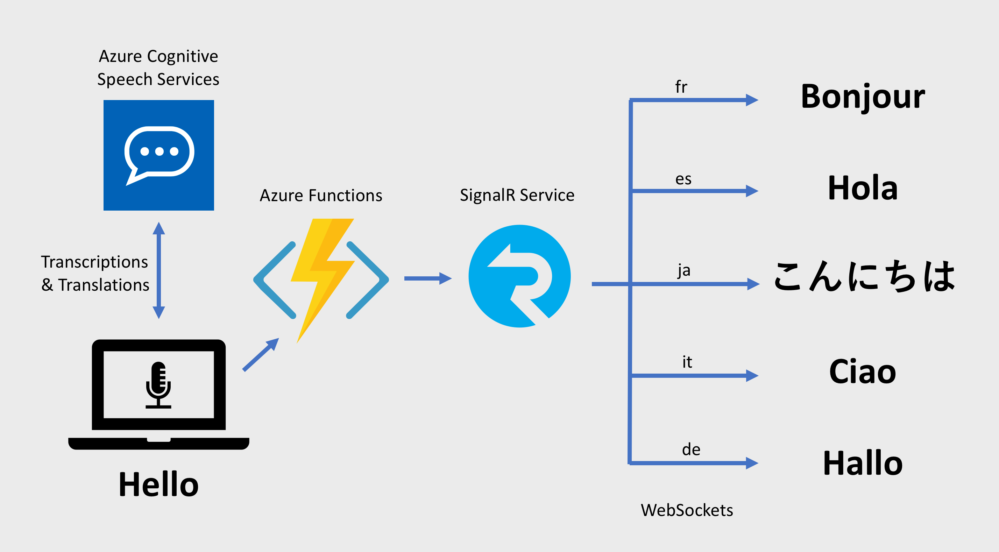

# CaptionR

Serverless real-time captioning and translation using:

* Microsoft Azure Cognitive Services - [Speech-to-Text JavaScript SDK](https://www.npmjs.com/package/microsoft-cognitiveservices-speech-sdk)
* [Vue.js](https://vuejs.org/)
* [Azure Functions](https://docs.microsoft.com/azure/azure-functions/?WT.mc_id=captionr-github-antchu)
* [Azure SignalR Service](https://docs.microsoft.com/azure/azure-signalr/?WT.mc_id=captionr-github-antchu)

<iframe width="560" height="315" src="https://www.youtube.com/embed/YLtXoGk8A1c" frameborder="0" allow="accelerometer; encrypted-media; gyroscope; picture-in-picture" allowfullscreen></iframe>



## Project setup

The app has 2 main projects:
* Vue.js frontend in `src/vueapp`
* Azure Functions backend in `src/functions-javascript` (C# and Java also available)

### Azure resources

You'll also need to create a couple of free resources on Azure to get started:

#### Azure Speech Services - free tier

```bash
az cognitiveservices account create -n $SPEECH_SERVICE_NAME -g $RESOURCE_GROUP_NAME --kind SpeechServices --sku F0 -l westus
az cognitiveservices account keys list -n $SPEECH_SERVICE_NAME -g $RESOURCE_GROUP_NAME
```

`F0` is the free SKU. You can also create it in the [portal](https://portal.azure.com/?WT.mc_id=captionr-github-antchu#create/Microsoft.CognitiveServicesSpeechServices).

#### Azure SignalR Service - free tier

```bash
az signalr create -n $SIGNALR_NAME -g $RESOURCE_GROUP_NAME --sku Free_DS2 -l westus
az signalr key list -n $SIGNALR_NAME -g $RESOURCE_GROUP_NAME
```

You can also create it using the [portal](https://portal.azure.com/?WT.mc_id=captionr-github-antchu#create/Microsoft.SignalRGalleryPackage).

### Vue.js app

Install npm packages and start the Vue.js dev server:

```bash
npm install
npm run serve
```

### Azure Function app

Create a file named local.settings.json (copy from local.settings.sample.json). Fill in the SignalR Service connection string.

With the [Azure Functions Core Tools](https://docs.microsoft.com/azure/azure-functions/functions-run-local?WT.mc_id=captionr-github-antchu#install-the-azure-functions-core-tools) installed, run the function app:

(JavaScript)

```bash
func extensions install
func start
```

## More information

Check out the [blog post](https://anthonychu.ca/post/realtime-captioning-translation-cognitive-services-signalr-azure-functions/).